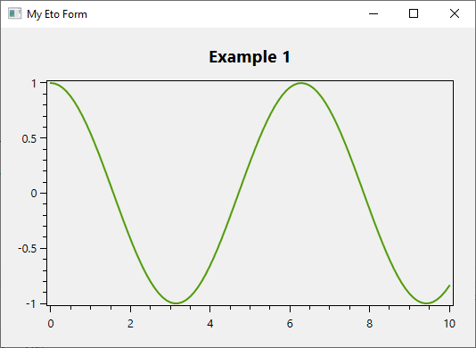

# OxyPlot.Eto

[](https://github.com/rafntor/OxyPlot.Eto/actions/workflows/build.yml)
[](https://sonarcloud.io/summary/new_code?id=rafntor_OxyPlot.Eto)
[](https://www.nuget.org/packages?q=OxyPlot.Eto)
[](LICENSE)

This project provides two controls for using [OxyPlot](https://github.com/oxyplot/oxyplot) with [Eto.Forms](https://github.com/picoe/Eto).  
The first is a port of the WindowsForms backend of OxyPlot and is forked from https://github.com/mostanes/OxyPlot.EtoForms. This package uses only Eto drawing functionality and has no additional dependencies.  
The second uses [SkiaSharp](https://github.com/mono/SkiaSharp) via the package provided by OxyPlot and has more complete support for advanced graphichs but at the cost of additional dependencies.

|Pure Eto.Forms Version|Eto.Forms + SkiaSharp|
|---|---|
|[](https://www.nuget.org/packages/OxyPlot.Eto/)|[](https://www.nuget.org/packages/OxyPlot.Eto.Skia/)|

Demo applications : https://nightly.link/rafntor/OxyPlot.Eto/workflows/build/master

## Quickstart

Use NuGet to install [`OxyPlot.Eto`](https://www.nuget.org/packages/OxyPlot.Eto/), then add a `OxyPlot.Eto.PlotView` Control to your Form or Container by using the following example:  
```cs
	this.Title = "My Eto Form";

	var myModel = new PlotModel { Title = "Example 1" };
	myModel.Series.Add(new FunctionSeries(Math.Cos, 0, 10, 0.1, "cos(x)"));
	var plotView = new PlotView() { Model = myModel };

	this.Content = plotView;
```

  
